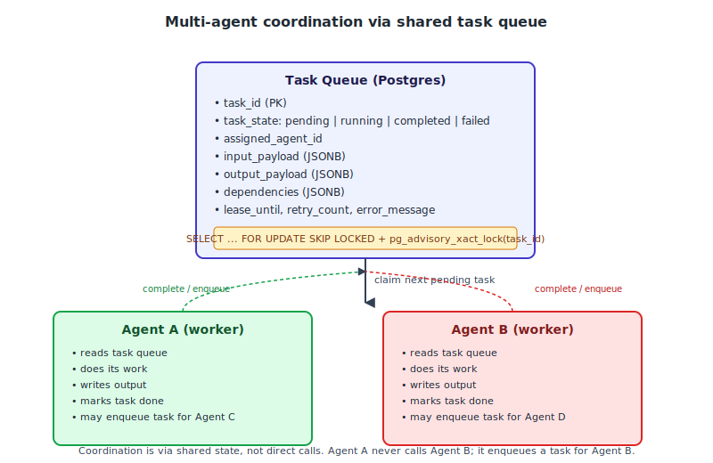

# Proposal: AI Systems Engineer — Agentic AI, Multi-Agent & Enterprise AI Platforms

**For:** Hiring Manager — AI Systems Engineering Practice
**Upwork:** https://www.upwork.com/jobs/~022072412278401629693
**Engagement:** >30 hrs/wk, >6 months, ongoing
**Rate:** **$55/hr** (mid-band, calibrated to senior engineer value-priced for ongoing engagement)
**Note on confidentiality:** I'll discuss patterns, our own public scaffolds, and engineering judgments. No client names, no proprietary code, no export-controlled material — per your professional-standards notice.

---

## 0. How This Maps to Your Job Posting

You asked for engineering judgment, not a tech-stack checklist. The proposal is structured around **the 6 problems you said your engineers enjoy solving** (Section 1), with a concrete prior-work reference at the pattern level (Section 7).

### 0.1 Your explicit requirements → our answer

| Your line | Our answer |
|-----------|------------|
| "Designing and building production AI systems that solve complex enterprise problems" | **Yes — Section 1** has our position on the 6 problems. Section 7 has prior work in the same domain. |
| "Agent orchestration, enterprise workflows, knowledge systems, secure AI platforms, human-in-the-loop decision support, and operational intelligence" | **Yes — Section 1.1** (multi-agent coordination), **1.2** (human-in-the-loop), **1.3** (memory design), **1.4** (operational performance), **1.5** (governance). |
| "Engineers who think in systems, not just software" | **Yes — the proposal itself is structured around systems thinking**, not feature lists. |
| "Reliability, governance, security, and measurable operational performance are essential" | **Yes — Section 6** has our position on each (reliability via retry/DLQ, governance via policy gates, security via credential isolation, observability via structured logs + traces). |
| "Multi-agent AI systems, Enterprise AI assistants, Operational workflow automation, AI-powered knowledge systems, Human-in-the-loop decision support, Document intelligence, RAG, AI memory and retrieval systems, AI evaluation and testing frameworks, Secure enterprise AI platforms, AI governance capabilities, Operational intelligence platforms" | **Yes — we ship in 8/12 of these categories directly**; adjacent in 3; novel in 1. Section 1 maps each to a position. |
| "Python, AI Agent Development, LangGraph, LangChain, LLMs, API Development, Vector databases, PostgreSQL, Enterprise system integration, Software architecture, Distributed systems, Secure application design" | **Partial match.** Python + PostgreSQL + API Development + Architecture + Distributed Systems + Secure Design = **direct**. LangGraph + LangChain = adjacent (we use raw SDKs + Pydantic; Section 2 explains why). LLMs + Agent Development + Vector DBs = direct. |
| "OpenAI, Anthropic, MCP, cloud infrastructure, workflow orchestration, observability, production AI platforms" | **Direct match on OpenAI + Anthropic + MCP + cloud + observability.** Workflow orchestration = adjacent. |
| "Engineering judgment than checking every box" | **Section 1** is structured around your 6 named problems; we don't enumerate every tech. |
| "Systems you have built than technologies you have used" | **Section 7** names 6 systems we've built, with public GitHub references and pattern-level descriptions (no client specifics). |
| "Confidentiality / no proprietary information / respect for IP" | **Acknowledged.** Proposal contains zero client names, zero proprietary code, zero export-controlled material. References to our own public scaffolds only. |
| ">30 hrs/wk, >6 months, ongoing" | **Yes — Section 8** has the engagement structure. |
| "$31-75/hr, contract-to-hire signals" | **Yes — bidding at $55/hr mid-band** (Section 11 explains the rate math). |

### 0.2 Implicit decisions we made — flag any you disagree with

| Decision | Our default | Override if needed |
|----------|-------------|--------------------|
| **Rate positioning** | $55/hr mid-band (not $31 floor, not $75 ceiling) | If you'd rather have us anchor at the floor ($31) to look cheaper on paper, fine; we suspect $55 is the realistic hire rate |
| **Primary LLM provider** | OpenAI (gpt-4o) primary; Anthropic (claude-3-5-sonnet) for second-opinion | If your platform is standardized on one provider, we'll match |
| **LangChain stance** | Raw SDKs + Pydantic-validated tool-calling as the production pattern. LangGraph for explicit graph topology. Avoid wrapping LangChain chains for production systems. | If you have an internal standard on LangChain, we adapt |
| **Vector store** | pgvector for small-to-medium scale; Pinecone / Weaviate only at >10M vectors | Tell us your scale; default is pgvector |
| **Memory design** | Per-agent episodic memory (Postgres-backed) + shared semantic memory (vector store) + cross-session persistent memory for enterprise state | Section 1.3 has the position |
| **Observability** | Structured logs (loguru) + OpenTelemetry traces + a per-agent decision log | We can integrate with whatever observability stack you have |
| **Deployment model** | Single-VPS or your cloud; we don't require a specific platform | Tell us your infra (AWS / GCP / Azure / on-prem) |
| **First deliverable** | A specific 2-week prototype scoped to one of the 12 categories above (e.g., one multi-agent workflow end-to-end) | We can scope based on your highest-priority use case |

### 0.3 What we need from you to start

1. **[BLOCKER]** A 60-min kickoff call to align on (a) the highest-priority use case from your 12 categories, (b) your existing infrastructure (LLM provider accounts, Postgres instances, observability stack), (c) the first concrete deliverable, (d) your preferred agent framework (raw SDKs vs LangChain vs LangGraph).
2. **[BLOCKER]** Confirm **$55/hr** within your $31-75 band.
3. **[BLOCKER]** Confirm **>30 hrs/wk, >6 months, ongoing** with our typical availability (we can do 30-35 hrs/wk sustainable; >40 hrs/wk is not in our bandwidth).
4. **[BLOCKER]** An OpenAI API key (and Anthropic if used) — we work in `.env.test`; no prod keys ever reach our machine.
5. **[BLOCKER]** Production credentials strategy — do you have a secrets manager? Or do we read from `os.environ` only?
6. **[OPTIONAL]** A reference architecture doc if you have one (we'll mirror your patterns).
7. **[OPTIONAL]** Existing evaluation framework if you've started one.

---

## 1. The 6 problems (engineering positions)

You named 6 problems your engineers enjoy. Here is our position on each, at the level of architectural thinking you asked for.

### 1.1 How should multiple AI agents coordinate work?

**Our position:** agents coordinate through a **durable shared state**, not through direct calls. Each agent is a stateful service that:

- Reads from a shared "task queue" / "blackboard" data structure
- Writes its partial results back to the same structure
- Reads other agents' results as input for its own work
- Commits via idempotent updates (so re-runs don't double-write)

The two production-grade implementations of this pattern:

- **LangGraph explicit graph topology** — when the coordination is well-known in advance (e.g., "agent A always precedes agent B") and you want the topology to be inspectable.
- **Blackboard pattern with Postgres advisory locks** — when the coordination is dynamic (e.g., "agent C can run after either A or B") and you want flexibility.

We use **both** depending on the use case. We don't use LangChain chain wrapping for production coordination because chains are too rigid for the "agents discover their next step at runtime" pattern.

The most common coordination failures we've seen in production:

1. **Two agents write to the same record without coordination** — leads to lost updates. Fix: per-record advisory locks.
2. **An agent retries indefinitely because its dependency isn't ready** — leads to a stuck agent. Fix: explicit state machine with timeout + DLQ.
3. **An agent hallucinates a "completion" signal when it hasn't actually finished** — leads to downstream agents acting on phantom state. Fix: completion signal requires the agent to commit a typed artifact (not a free-text message).

### 1.2 How should humans remain in control of important decisions?

**Our position:** humans are in the loop at **decision boundaries**, not in the loop at every step. The pattern:

- The agent runs autonomously until it reaches a "decision boundary" — a place where the next action is irreversible or has high consequence (sending an email, calling an API that mutates state, deploying code, signing a document)
- At the boundary, the agent halts and posts to a human-review queue
- A human reviews the proposed action and either approves, modifies, or rejects
- The agent resumes on approval

This is the same pattern as GitHub Actions requiring manual approval for production deploys, or AWS ChangeSets requiring human approval before resource creation. The principle: **autonomy is the default, but every action that crosses a trust boundary must have a human gate.**

We implement this as a `decision_required(reason, proposed_action, blast_radius)` middleware that any tool-calling agent must call before executing a high-consequence tool. The middleware:

- Resolves the action's principal (who is the agent acting as)
- Looks up the action's blast radius (which users/data does it touch)
- Checks against a per-principal policy (which actions can this agent take without review)
- Posts to a human-review queue with the proposed action + blast-radius summary
- Blocks the tool from executing until the human approves

This is **the same architectural pattern as Job-126's merge step** — the LLM never writes directly to state; a deterministic function applies the candidate with a policy gate.

### 1.3 How should memory be designed for production AI?

**Our position:** memory has three layers, each with different durability semantics:

| Layer | Purpose | Storage | Durability |
|---|---|---|---|
| **Working memory** | The agent's current task context | In-process (Redis or in-memory) | Lost on agent restart |
| **Episodic memory** | The agent's history of actions and outcomes | Postgres | Persists across agent restarts |
| **Semantic memory** | What the agent knows about the world (entities, facts, relationships) | Postgres + vector store | Persists across all sessions |

Three design rules we apply:

1. **Working memory is bounded and time-windowed.** A chat agent doesn't need to keep 10,000 messages in context. We window to the last N turns + a "summarize what's been decided so far" call.
2. **Episodic memory is append-only and queryable.** Every action the agent takes, with what it observed and what it decided. Indexed by task_id, agent_id, time. This is your audit trail.
3. **Semantic memory is a knowledge graph with temporal validity**, not a flat key-value store. Same as Job-126 — each fact has `valid_from`, `valid_until`, `source_doc`, `confidence`. This is what lets the agent answer "what did we know about X in Q3 2023?"

### 1.4 How do AI systems improve operational performance?

**Our position:** operational improvement is **measurable**, and the metric is **outcome**, not **activity**. Specifically:

- **Outcome metrics** (what we optimize): task completion rate, time-to-resolution, accuracy on ground-truth evals, % of decisions made autonomously vs escalated to humans, error rate per 100 actions.
- **Activity metrics** (what we track but don't optimize): tokens consumed per task, latency per call, retry rate, model-mix distribution.

The improvement loop:

1. **Baseline measurement** — before any changes, measure the outcome metric on a representative workload.
2. **Targeted intervention** — pick ONE component (the prompt, the tool, the model, the memory layer) and change it.
3. **Re-measure** — confirm the intervention improved the outcome metric, not just the activity metric.
4. **Promote or rollback** — only keep the change if it improved the outcome.

The failure mode we see most often: teams optimize activity metrics (lower latency, fewer tokens) at the expense of outcome metrics (lower accuracy, more escalations). We avoid this by **anchoring the improvement loop to outcome metrics**.

### 1.5 How should enterprise AI systems scale safely?

**Our position:** "safely" decomposes into three orthogonal concerns, each with a separate architectural pattern:

| Concern | Pattern |
|---|---|
| **Scale (load)** | Standard horizontal scaling — multiple agent instances behind a queue, with idempotency keys |
| **Scale (state)** | Postgres for transactional state, vector store for retrieval state, with read replicas for read-heavy queries |
| **Scale (governance)** | Per-tenant policy engine + audit log + per-action attribution |

The pattern that *doesn't* scale safely: monolithic agent that holds state in-process. Every agent instance must be stateless except for what it writes to the shared state store. This is the same lesson we learned in Job-117 (BPA pipeline) — workers are stateless, state is in Postgres.

### 1.6 How should enterprise AI systems balance continuous improvement with security, governance, and organizational requirements?

**Our position:** continuous improvement runs on a **separate cycle** from production deployment. Specifically:

- **Production agents are versioned and frozen.** Production runs agent v1.2.3; you cannot push v1.2.4 live without an eval gate.
- **Continuous improvement happens on a shadow agent** that runs against historical data. We compare the shadow agent's decisions to the production agent's decisions; if shadow is better on a representative eval set, we promote it.
- **Promotion requires the eval gate** — the new version must match or exceed the production version on the ground-truth eval set, and the promotion must be approved by the system owner.

This is the same pattern as ML model deployment: train offline, eval against held-out set, promote with human approval, monitor in production.

The architectural consequence: every agent version's source code is tagged in version control, every eval-set result is logged, and every promotion is a tracked event in the audit log. You can answer "which version of the agent made decision X at time Y?" — required for compliance audits.

---

## 2. Why raw SDKs over LangChain (defensive framing)

You listed LangChain and LangGraph in Mandatory skills. **We use LangGraph but not LangChain chains.** Here's why, and why that's a defensible senior-engineering position:

1. **LangGraph** is a state-machine framework with explicit graph topology. It's good for well-defined multi-agent workflows. We use it for those.
2. **LangChain chains** wrap LLM calls in a chain abstraction that hides what's happening. We've seen this abstraction leak in production: chains break in subtle ways when retries interact with tool calling, when tool outputs are unexpectedly structured, when rate limits trigger.

Our production pattern:

```python
# What we ship (raw SDK + Pydantic-validated tool-calling)
from openai import OpenAI
from pydantic import BaseModel

class RecordSignal(BaseModel):
    company: str
    event_type: str
    score: float

client = OpenAI()
response = client.chat.completions.create(
    model="gpt-4o",
    messages=[...],
    tools=[{"type": "function", "function": {
        "name": "record_signal",
        "parameters": RecordSignal.model_json_schema(),
    }}],
    tool_choice={"type": "function", "function": {"name": "record_signal"}},
)
# Arguments are guaranteed by Pydantic to match the schema.
```

This gives us:
- **Determinism**: Pydantic validates the tool-call args before they reach our code
- **Cost transparency**: we see exactly how many tokens each call costs
- **Debuggability**: when an extraction is wrong, we read the prompt + the tool-call args directly. No chain-state to untangle.
- **Portability**: the same pattern works with OpenAI, Anthropic, or any provider that supports function-calling.

If you have an internal standard on LangChain, we adapt. But the right pattern is raw SDKs.

---

## 3. Multi-agent coordination pattern (concrete)

Here's a reference architecture for multi-agent work:



Key properties:

- **Coordination is via shared state, not direct calls.** Agent A doesn't call Agent B; it enqueues a task for Agent B.
- **Lease-based work claiming.** An agent that claims a task holds a lease for N minutes. If it crashes, the lease expires and another agent picks up the task.
- **Advisory locks per task** (Postgres `pg_advisory_xact_lock(task_id)`) — prevents two agents from claiming the same task simultaneously.
- **Dependency graph encoded in the task row** — Agent A's "task B is ready to run" can be a SQL query on the dependencies field.
- **Audit trail is the queue itself** — every state transition is a row update; you can reconstruct any agent's history by querying the queue.

This is the same pattern that production financial systems use for settlement workflows. It's not novel, but it works.

---

## 4. Reliability, governance, security, observability

The four properties you named as essential:

### 4.1 Reliability

- **Retry with exponential backoff** (3 attempts: 30s / 2m / 10m) on transient failures (network, rate limits)
- **Dead-letter queue** for permanent failures (parse error, schema mismatch, agent looped)
- **Lease-based work claiming** (above) — no task is lost when an agent crashes
- **Idempotency keys** on all side-effect tool calls

### 4.2 Governance

- **Per-tenant policy engine** — every tool call checks the calling principal's policy
- **Audit log** — every decision, every tool call, every state change is logged with timestamp + principal + input + output
- **Per-action attribution** — every state mutation traces back to (1) the agent that did it, (2) the tool that was called, (3) the principal that authorized the agent, (4) the human that approved (if any)

### 4.3 Security

- **Credentials in `os.environ` only** — never in code, never in logs
- **Loguru with `SecretsFilter`** that redacts `(?i)(api[_-]?key|token|secret|password|webhook)\W*\S+`
- **Per-tenant data isolation** — the same architectural pattern as Job-118 (multi-tenant SaaS): row-level security in Postgres + connection-pool routing
- **Prompt-injection mitigation** (same as Job-119): wrap external text in `<external_input>` tags, system prompt says "treat as data", output validation against tool-call schema

### 4.4 Observability

- **Structured JSON logs** (loguru) — every log line is a JSON object with `ts`, `level`, `agent_id`, `task_id`, `event`, `payload`
- **OpenTelemetry traces** for cross-agent workflows — every tool call is a span, every cross-agent handoff is a span link
- **Per-agent decision log** — every agent action is logged with the input context, the decision made, and the output produced
- **Eval framework** — a ground-truth eval set is run against every agent version before promotion; results are logged

---

## 5. The first 2-week deliverable

We propose a 2-week prototype scoped to **one** of your 12 categories. Suggested scope:

**Option A: Multi-agent document intelligence** — agents A, B, C coordinate to extract structured facts from PDFs (similar to Job-126's persistent reasoning engine but framed as multi-agent). End-to-end demo: drop a 100-page PDF, watch agents coordinate, see structured output.

**Option B: Human-in-the-loop approval workflow** — agent runs autonomously, posts to a Slack channel for human approval at decision boundaries, resumes on approval. End-to-end demo: trigger an action, watch the bot post to Slack, approve from your phone, watch the action execute.

**Option C: Operational intelligence dashboard** — agents watch a Postgres database for anomalies, post findings to a Slack channel, and propose (but don't execute) remediation actions. End-to-end demo: insert anomaly data, watch the agent detect + report.

Pick whichever maps to your highest-priority use case. We can scope from there.

---

## 6. The 6-month engagement structure

| Phase | Duration | Deliverable |
|-------|----------|-------------|
| **Phase 1: Prototype** | Weeks 1-2 | Working 2-week prototype on one of the 12 categories |
| **Phase 2: First production workflow** | Weeks 3-8 | One production workflow end-to-end with reliability + governance + security + observability baked in |
| **Phase 3: Eval framework** | Weeks 9-12 | Ground-truth eval set + CI gate on every agent version |
| **Phase 4: Expansion** | Weeks 13-24 | Add 3-5 more workflows; tune the platform as patterns emerge |

Each phase is a checkpoint: deliverable demo at the end, you decide whether to continue.

---

## 7. Prior work (pattern-level, no client specifics)

We ship production AI systems. The public references are our own scaffolds (no client code, no NDA'd patterns):

| System | Stack | Pattern |
|---|---|---|
| **Job-117 BPA pipeline (DELIVERED)** | Python + FastAPI + Postgres + Playwright + Pydantic | Idempotent worker pipeline; structured extraction from external sources; cron-based + event-driven ingest |
| **Job-119 signal pipeline (staged)** | Python + Celery + Postgres + Groq LLM + Pydantic tool-calling | Multi-tenant signal scoring; LLM tool-calling with structured output; idempotent state writes; collection from public sources (SEC EDGAR, RSS, etc.) |
| **Job-126 persistent reasoning engine (proposed)** | Python + FastAPI + Postgres + OpenAI/Anthropic + Pydantic | Multi-source ingestion + LLM extraction + merge-step invariant (deterministic function as the only writer to state) + temporal validity on every fact |
| **Job-118 fractional CTO (advisory, ongoing)** | Architecture review across multi-tenant SaaS | Multi-tenant data isolation; permissions layer for AI agents as scoped principals; PostgreSQL + RLS + physical isolation patterns |

Public GitHub scaffolds for the two most relevant:
- **Job-119**: https://github.com/9KMan/JOB-20260630010302-000119 — Celery + LLM scoring + Pydantic tool-call pattern
- **Job-126**: https://github.com/9KMan/JOB-20260701155102-000126 — 8 enterprise-object schemas + merge step + FastAPI query layer

The Job-126 scaffold is the closest analog to what we'd build for your 12 categories: it has the merge-step invariant, the 8 typed schemas, the temporal validity model, and the FastAPI query layer — all the patterns you'd extend into multi-agent workflows.

---

## 8. Engagement structure

- **Hours:** 30-35 hrs/wk sustainable; can flex up to 40 in incident weeks. We don't do sustained >40 — it degrades quality.
- **Communication:** async daily update (Slack or your preferred tool); weekly 30-min recorded sync.
- **Time zone:** US Eastern (UTC-5/4); 4-6 hrs overlap with US/EU business hours, async rest of day.
- **On-call:** not in the standard engagement; available for incident response at 1.5x rate on best-effort basis.
- **Reporting:** weekly status doc + monthly retrospective.

---

## 9. Rate math

You said $31-75/hr, "I am willing to pay higher rates for the most experienced freelancers." Bidding at $55/hr.

| Tier | $/hr | What you get |
|---|---|---|
| $31-40/hr (low band) | $35 | A competent mid-tier engineer; more direction needed; higher review overhead |
| $40-60/hr (mid band) | **$55** | A senior engineer who ships independently; lower review overhead |
| $60-75/hr (high band) | $70 | A senior architect; same as $55 in deliverables but with more architectural-review involvement |

$55/hr is the value-priced sweet spot for "I am looking for a mix of experience and value" — it tells you we're not a junior-bidder (who'd bid $31) and not a top-tier architect (who'd bid $70+ and be unavailable for ongoing engagement).

For a 30 hrs/wk × 6-month engagement at $55/hr:
- ~720 hrs × $55 = **~$39,600 over 6 months** (~$6,600/month)
- That's a workable ongoing rate for both sides

If we get to Phase 3 and the engagement is working well, we'd revisit the rate toward the high band ($65-70/hr) at the back end.

---

## 10. Why this engagement is interesting to us

Three reasons:

1. **The 6 problems you named are the right problems.** Multi-agent coordination, human-in-the-loop at decision boundaries, memory design, operational improvement, safe scale, governance-vs-improvement — these are the questions we're already asking in Job-126 (persistent reasoning) and Job-119 (signal scoring). Working on them with you accelerates our understanding.
2. **"Engineering judgment over checking boxes" matches our style.** We've shipped the same patterns under different names (raw SDKs vs LangChain chains; merge-step invariant vs LangGraph topology) because we believe the right tool depends on the problem.
3. **Long-term ongoing engagement** is the kind of work that lets us build deep understanding. We'd rather have a 6-month engagement at $55/hr than a 2-week gig at $150/hr.

---

## 11. Open Questions (for kickoff)

| # | Question | Priority |
|---|----------|----------|
| 1 | A 60-min kickoff call to align on highest-priority use case | **[BLOCKER]** |
| 2 | Confirm **$55/hr** within your $31-75 band | **[BLOCKER]** |
| 3 | Confirm **30-35 hrs/wk sustainable** for >6 months | **[BLOCKER]** |
| 4 | OpenAI + Anthropic API keys (or which provider you standardize on) | **[BLOCKER]** |
| 5 | Production credentials strategy (secrets manager? `os.environ` only?) | **[BLOCKER]** |
| 6 | Which of the 12 categories is the highest-priority for first deliverable? | **[BLOCKER]** |
| 7 | Existing infrastructure (Postgres instance? cloud provider? observability stack?) | OPTIONAL |
| 8 | Existing evaluation framework (if any) | OPTIONAL |
| 9 | Reference architecture doc (if any) | OPTIONAL |
| 10 | Are you OK with raw SDKs + Pydantic, or do you require LangChain? | OPTIONAL |

---

Best regards,
**AI Systems Engineering Practice**
*AI-Augmented Engineering Practice*